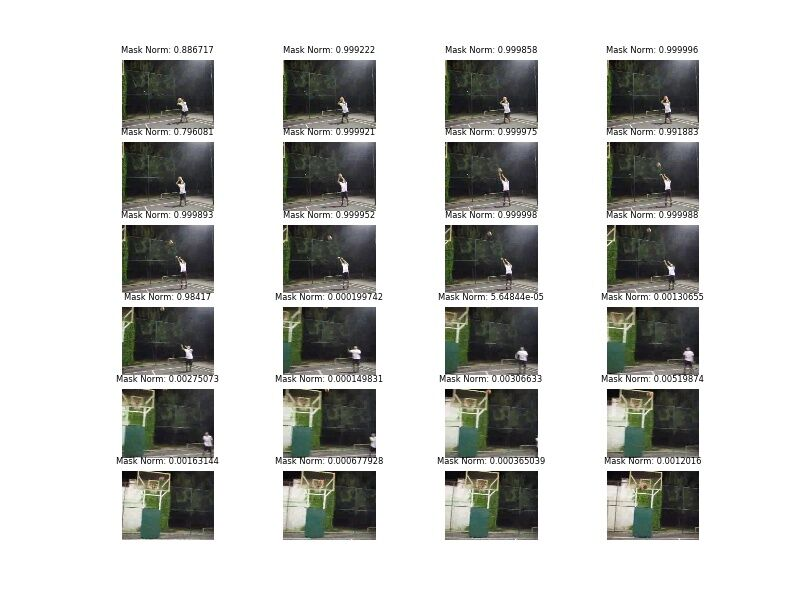

# AdaScan 

This repository contains the source code for the paper [Adascan: Adaptive Scan Pooling in Deep Convolutional Neural Networks for Human Action Recognition in Videos](https://arxiv.org/abs/1611.08240), [Amlan Kar](http://amlankar.github.io)\* (IIT Kanpur), [Nishant Rai](http://nishantrai18.github.io)\* (IIT Kanpur), [Karan Sikka](http://ksikka.com) (UCSD and SRI), [Gaurav Sharma](http://grvsharma.com) (IIT Kanpur), with support for multi-GPU training and testing.

## Dependencies
* [Tensorflow](https://tensorflow.org) (this repository uses version 0.11)
* [Numpy](http://www.numpy.org/)
* [skimage](http://scikit-image.org/docs/dev/api/skimage.html)
* [skvideo](http://www.scikit-video.org/stable/io.html)

> Note: skimage and skvideo are required for the preprocessing step

## Setup
* Download UCF-101 dataset from [here](http://crcv.ucf.edu/data/UCF101.php) and UCF-101 flow files from [here]( https://github.com/feichtenhofer/twostreamfusion)
* Download UCF-101 action recognition splits from [here](http://crcv.ucf.edu/data/UCF101/UCF101TrainTestSplits-RecognitionTask.zip) (to be passed using -split_dir)
* Run preprocessing script to create npz files required for training/testing (directory created to be passed using -data_dir)

### Training from scratch
* [RGB training] Download VGG numpy files from [here](https://mega.nz/#!YU1FWJrA!O1ywiCS2IiOlUCtCpI6HTJOMrneN-Qdv3ywQP5poecM) (to be passed using -vgg_npy_path)
* [Optical Flow training] Download the pre-trained caffe models for flow from [here](https://github.com/yjxiong/caffe/tree/action_recog/models/action_recognition) and convert them using [this](https://github.com/ethereon/caffe-tensorflow) tool to numpy files
* Edit sample_train.sh and run

### Testing pre-trained models or self-trained models
* Download the pre-trained models from the given links below
* Download VGG numpy file for RGB and any one of the flow files to pass with -npy_path for testing (This is an extra step and doesn't change anything, we will remove this unneccessary step soon)
* Edit sample_test.sh and run

## Visualizing on custom video (only for RGB)
```
python demo.py -ckpt_file path/to/ckpt/file -vid_file vis/vid_file
```
This should save an image in vis/ that looks like:



## Pre-trained models (Coming Soon)
These models have been trained on UCF-101. We will be releasing the updated models soon.

### RGB
* [Split 1]()
* [Split 2]()
* [Split 3]()

### Flow
* [Split 1]()
* [Split 2]()
* [Split 3]()

## Training/Testing
Sample self explanatory train and test scripts have been provided with the code

## Updated Results
After fixing a bug post-submission, we have achieved higher results with the same configuration as in the original paper. We request authors to cite these numbers.

| Model               | UCF-101 | HMDB-51 |
| ------------------- | ------- | ------- |
| AdaScan             | 91.6    | 62.4    |
| AdaScan + iDT       | 93.1    | 67.6    |
| AdaScan + iDT + C3D | 94.0    | 69.4    |

## Reference

If you use this code as part of any published research, please acknowledge the
following paper:

**AdaScan: Adaptive Scan Pooling in Deep Convolutional Neural Networks for Human Action Recognition in Videos**  
Amlan Kar\*, Nishant Rai\*, Karan Sikka, Gaurav Sharma (\*denotes equal contribution)

    @article{kar2016adascan,
    title={AdaScan: Adaptive Scan Pooling in Deep Convolutional Neural Networks for Human Action Recognition in Videos},
    author={Kar, Amlan and Rai, Nishant and Sikka, Karan and Sharma, Gaurav},
    booktitle={CVPR}, 
    year={2017} 
    }  
